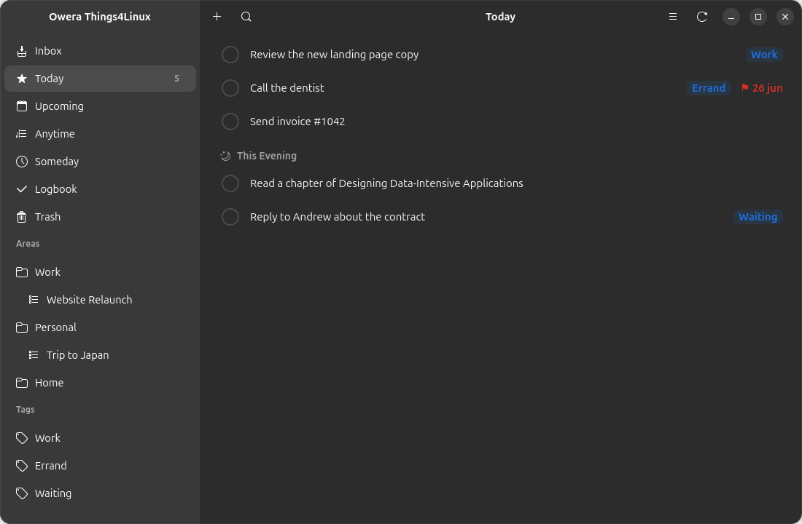
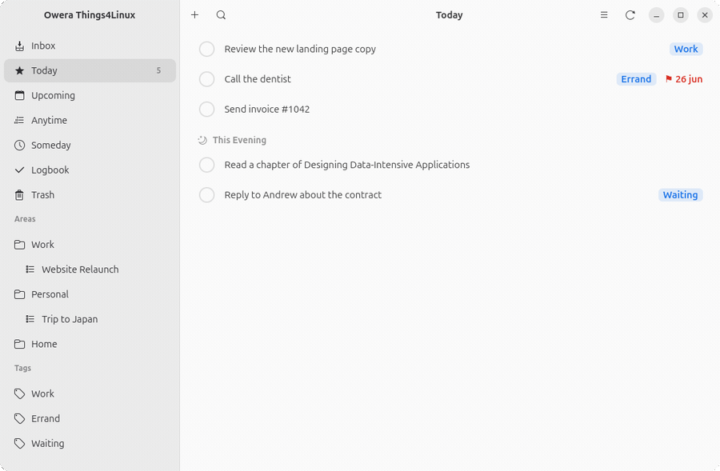
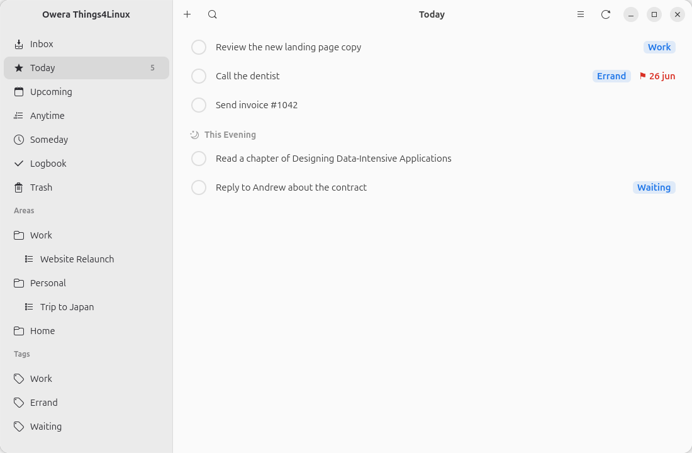
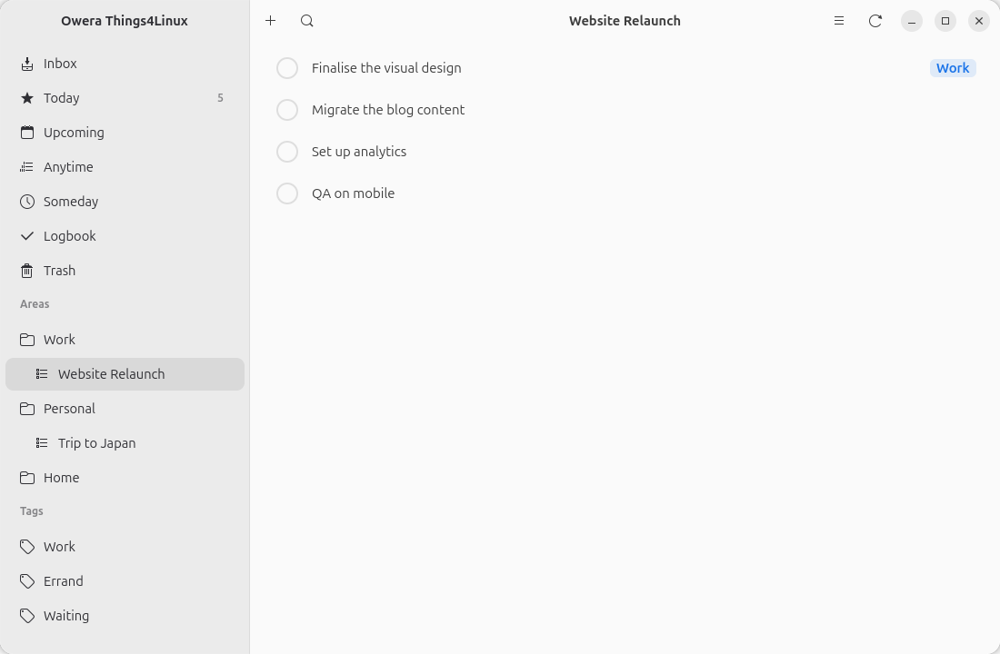
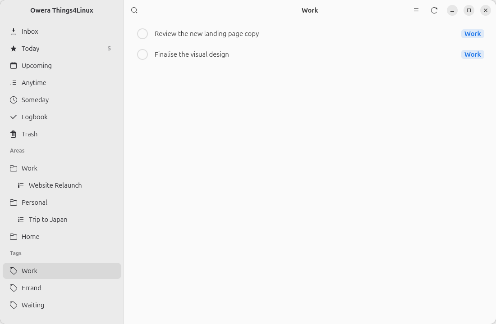
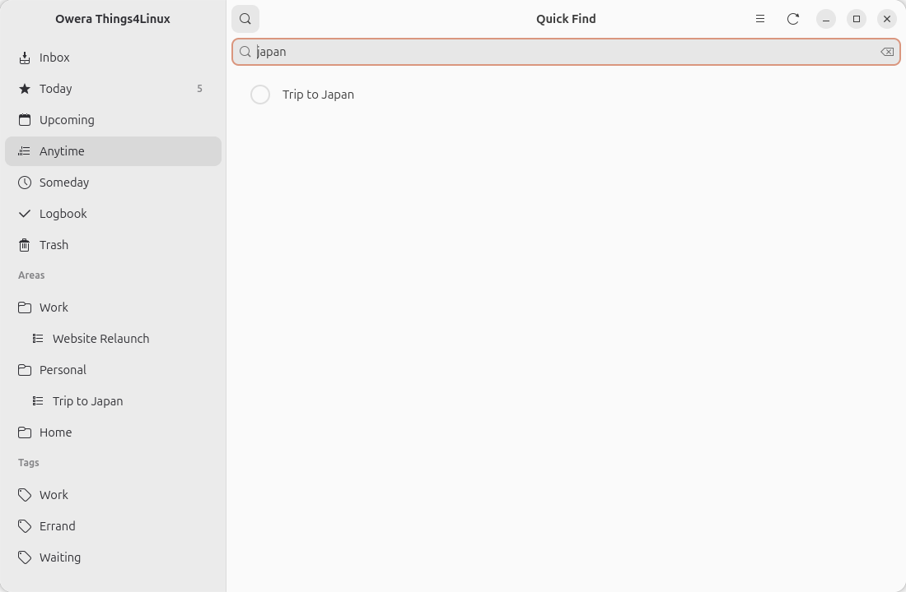

<div align="center">


# Owera Things4Linux

### A **Things-inspired** to-do app, native on Linux — syncing straight to your **Things Cloud** account.

[](#-license)




</div>

> [!WARNING]
> **Unofficial.** Things Cloud has no public API — this talks to it through a
> community-**reverse-engineered** protocol. It isn't affiliated with or endorsed
> by Cultured Code and could carry some account/ToS risk. **Try it with a
> secondary account first and keep a backup.** See [Safety](#-safety).

---

## ✨ See it in action

<div align="center">

</div>

<table>
  <tr>
    <td width="50%"><br><sub><b>Today</b> — daytime + This Evening, tags, deadlines</sub></td>
    <td width="50%"><br><sub><b>Projects</b> grouped under Areas in the sidebar</sub></td>
  </tr>
  <tr>
    <td><br><sub><b>Tags</b> — click one to filter your to-dos</sub></td>
    <td><br><sub><b>Quick Find</b> — fuzzy search everything</sub></td>
  </tr>
</table>

## 🎯 Features

**📥 Lists & views**
- The full set of built-in lists: **Inbox · Today · Upcoming · Anytime · Someday · Logbook · Trash**
- **This Evening** split in Today, and **Upcoming** grouped by day (Tomorrow, weekday, date)

**🗂️ Organise**
- **Areas → Projects → To-Dos**, with notes, a "When" date and a deadline
- **Tags** with a one-click sidebar filter
- **Empty Trash** to permanently delete (and sync the deletion)

**🔎 Find & fly**
- **Quick Find** fuzzy search across every to-do
- **Keyboard shortcuts** for everything (see below)

**☁️ Sync**
- **Two-way Things Cloud sync** in the background
- **Offline-first** — a local SQLite store is the source of truth; the app stays
  fully usable with no network and reconciles when it reconnects

## ⌨️ Keyboard shortcuts

| Shortcut | Action | | Shortcut | Action |
|---|---|---|---|---|
| `Ctrl`+`N` | New to-do | | `Ctrl`+`1`…`7` | Jump to a list |
| `Ctrl`+`F` | Quick Find | | `Ctrl`+`W` | Close window |
| `Ctrl`+`R` | Sync now | | `F1` | About |

A primary menu (☰) in the header also exposes New To-Do, Quick Find, Sync Now and About.

## 🚀 Install

### Flatpak (recommended)

```bash
flatpak install flathub org.gnome.Platform//47 org.gnome.Sdk//47
flatpak-builder --user --install --force-clean build \
    build-aux/com.owera.Things4Linux.yaml
flatpak run com.owera.Things4Linux
```

The manifest bundles `httpx` (pinned wheels in `build-aux/python3-httpx.json`) and
installs the desktop entry, icon and AppStream metadata. The sandbox is granted
network access (for sync) and `org.freedesktop.secrets` (for the keyring).

### From source

The GTK stack comes from your distro, **not** pip:

```bash
# Debian / Ubuntu
sudo apt install python3-gi gir1.2-gtk-4.0 gir1.2-adw-1 libgtk-4-1 libadwaita-1-0
# Fedora
sudo dnf install python3-gobject gtk4 libadwaita

pip install httpx          # the only required Python dependency
pip install keyring        # optional — secure credential storage

python3 -m things4linux    # run it
```

On first launch you'll enter your Things Cloud email and password once — they're
used to fetch your account's sync key; afterwards sync uses the key, not your
password.

## 🛡️ Safety

- **Try a secondary account first** — this is reverse-engineered software writing
  to your live task data.
- **Back up** before the first write (e.g. export from the official Things app).
- **Credentials** go to the system keyring (GNOME Keyring / Secret Service) when
  the optional `keyring` package is installed; otherwise they fall back to
  `~/.config/owera-things4linux/credentials.json` (`0600`).
- Local data lives in `~/.local/share/owera-things4linux/things.db` — delete it to
  start a clean re-sync (your cloud data is untouched).

## 🧭 Roadmap

Checklists · project headings · repeating to-dos · reminders · drag-and-drop
reordering · a global Quick Entry hotkey.

## 🛠️ How it works

```
GTK UI  ⇄  db.store (SQLite, source of truth)  ⇄  sync.engine  ⇄  Things Cloud
```

- `things4linux/sync/protocol.py` — the Things Cloud HTTP client (login →
  `history-key`, pull by `start-index`, push via `/commit`).
- `things4linux/sync/serde.py` — translates Things' cryptic two-letter wire fields
  (`tt`=title, `ss`=status, `sr`=when, `dd`=deadline …) to/from our model.
- `things4linux/db/store.py` — the local store and the queries behind each list.
- `things4linux/sync/engine.py` — the background pull/push loop, reconciled through
  a monotonic history index.

<details>
<summary><b>Protocol notes</b> (reverse-engineered, verified against a live account)</summary>

- **Auth:** `GET /version/1/account/{email}` with header
  `Authorization: Password <url-quoted-password>` (the password is *not* wrapped in
  quotes). Returns the `history-key`.
- **Read:** `GET /version/1/history/{key}/items?start-index=N`. A pull from `0`
  returns a *compacted base snapshot*; newer writes arrive by pulling
  **incrementally from your last head**. The engine keeps a persistent head and
  always pulls forward.
- **Write:** `POST /version/1/history/{key}/commit?ancestor-index=H`. A **create
  must send the *complete* object** — a partial one is silently orphaned by the
  server; edits send only changed fields.
- **Delete:** trashing is an edit setting `tr=true`; *permanent* deletion is a
  commit with op `t=2` and an empty payload — there is no separate tombstone entity.
- **Entity generations:** Things tags entities with a generation number
  (`Task`/`Task2`/`Task6`, …) that varies by account. We classify by stripping the
  digits and **learn which generation to write** from your own history so the
  official apps accept our writes.

</details>

## 👩‍💻 Development

```bash
python3 -m unittest discover -t . -s tests   # stdlib unittest, no pytest needed
xvfb-run python3 tools/screenshots.py        # regenerate the screenshots
```

Tests cover the serde field mapping, the store's view queries and dirty/queue
bookkeeping, and the sync engine end-to-end against an in-memory fake of the
Things Cloud server (including the stale-ancestor retry path).

## 🙏 Acknowledgements

Built on the community's reverse-engineering of Things Cloud —
[`disrupted/things-cloud-api`](https://github.com/disrupted/things-cloud-api) and
[`nicolai86/things-cloud-sdk`](https://github.com/nicolai86/things-cloud-sdk).
Things and Things Cloud are products of [Cultured Code](https://culturedcode.com/);
this project is independent and unofficial.

## 📄 License

MIT.
